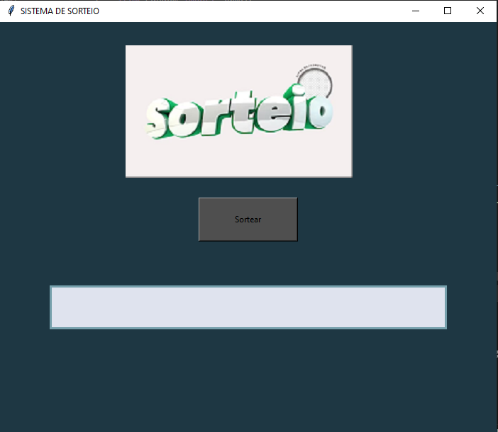

# Projeto_Algoritmo

Projeto desenvolvido em python. É um aplicativo de sorteio que gera números aleatoriamente, usando grafos PRM, mais conhecido como uma Arvóre Geradora miníma. Tem o famoso nome de ser um algoritmo guloso por ser uma árvore valorada, mas não direcionada. Na construção do projeto, implementei a biblioteca Tkinter, a mais famosa para interface gráfica, utilizando recursos como dimensão de tela, ressponsividade, label para deixa os elementos fixos na tela, o recurso de botão que ao clicado, sorteia os números.

<h1>
  

